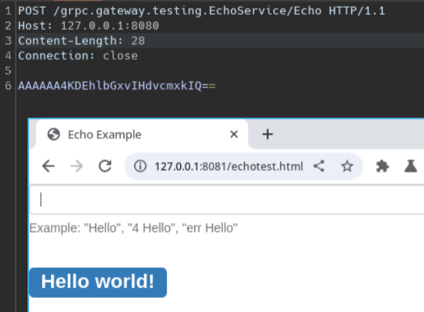
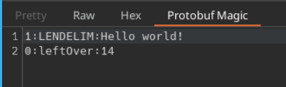

# Protobuf Magic

Protobuf Magic is a powerful Burp Suite extension that aims to analyze, modify, and send Protobuf (Protocol Buffers) messages without requiring the full .proto definitions. It is inspired by tools like InQL, but focuses specifically on working with Protobuf data.

## Features

- **Protobuf Analysis**: Protobuf Magic can analyze incoming Protobuf messages in Burp Suite's Proxy, Repeater, or Intruder and present them in a human-readable format, even without access to the original .proto files.
- **Message Modification**: The extension allows you to modify the content of Protobuf messages, making it easy to test different scenarios and edge cases without needing to recompile .proto files.
- **Message Sending**: Protobuf Magic enables you to send modified Protobuf messages directly from Burp Suite to the target, making it a powerful tool for testing Protobuf-based APIs and applications.

## Installation

1. Download the latest release from the [Releases](https://github.com/DeiteriyLab/protobuf-magic/releases) page.
2. In Burp Suite, navigate to the "Extender" tab, and click on "Add" under the "Extensions" tab.
3. Select the downloaded JAR file and click "Next."
4. Protobuf Magic will now be installed and ready to use in Burp Suite.

## Usage

    
    

1. Once installed, open or intercept traffic containing Protobuf messages in the Proxy, Repeater, or Intruder.
2. Protobuf Magic will automatically detect and analyze Protobuf messages in the request and response payloads.
3. In the Proxy and Repeater, you can modify the Protobuf message content before forwarding it to the server.
4. Use the "Send to Intruder" option to send the Protobuf message to Intruder for further fuzzing or other testing.

## Limitations

- Protobuf Magic may not be able to fully interpret complex Protobuf structures without access to the original .proto definitions. As a result, some nested or custom types may not be accurately displayed.
- Modifying Protobuf messages without knowing the exact message structure may lead to malformed or incorrect messages being sent to the server.

## License

Protobuf Magic is released under the GNU License. See [LICENSE](https://github.com/DeiteriyLab/protobuf-magic/blob/main/LICENSE) for more details.
